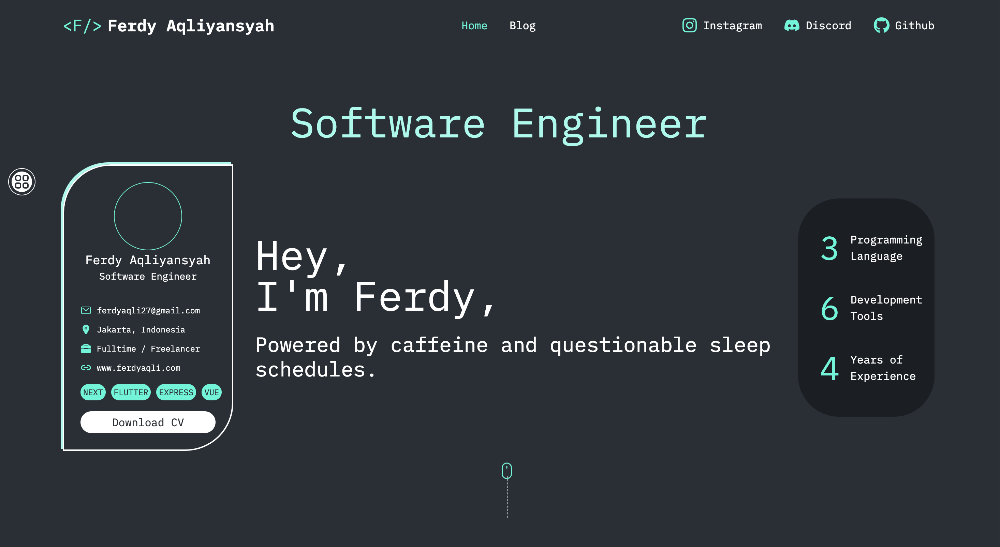
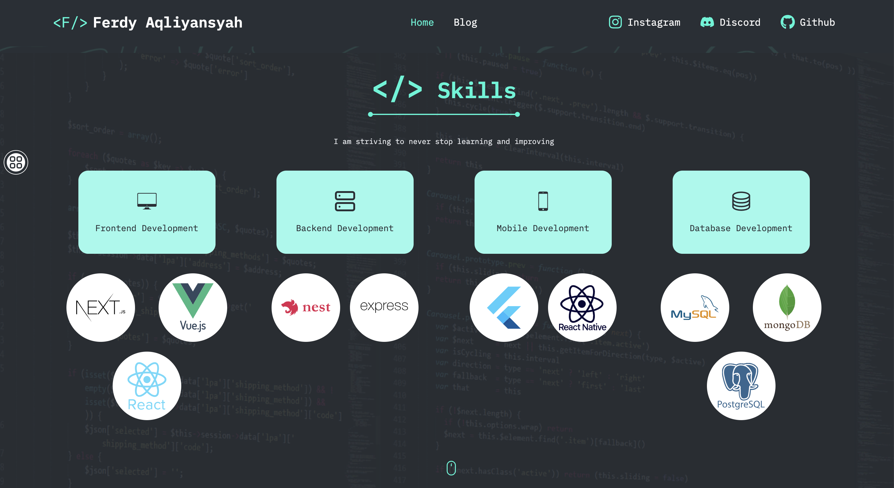

# 🚀 My Profile Website

## Ferdy Aqliyansyah - 24120310002





Figma reference: https://www.figma.com/community/file/1308624569713896610 (by [Johan Leon](https://www.figma.com/@johannleon2025))

## Run Locally

Clone the project

```bash
  git https://github.com/cotbakheu/ferdy-profile
```

Go to the project directory

```bash
  cd ferdy-profile
```

Install dependencies

```bash
  npm install
```

Start the development

```bash
  npm run dev
```
